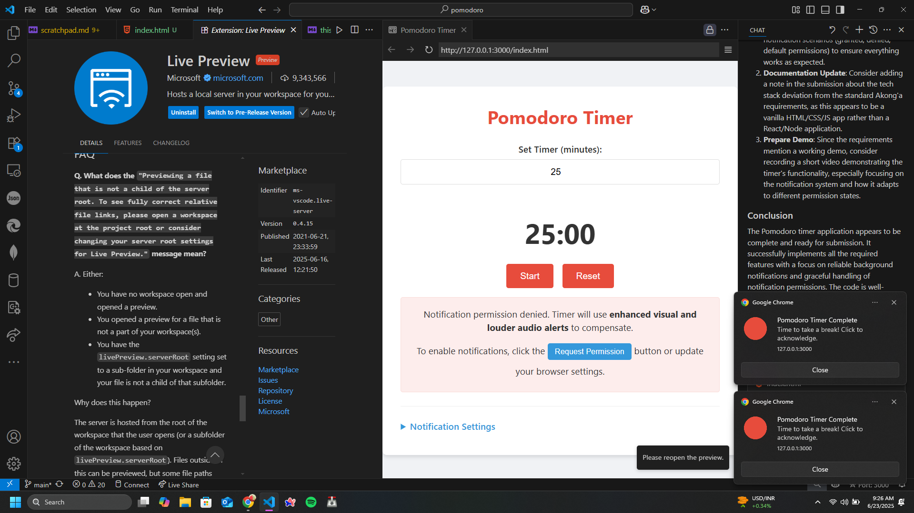

# Pomodoro Timer Web App - Bounty Solution Submission

## Problem Statement

This solution addresses the challenge of creating a reliable Pomodoro timer web application with a critical focus on ensuring background audio notifications work consistently in Chrome browser, even when the tab is inactive or minimized.

## Solution Approach

The implementation takes a progressive enhancement approach with multiple notification methods to ensure reliability across different browser permission scenarios:

1. Use Web Audio API with buffer creation for reliable background playback
2. Implement system notifications with permission handling
3. Add enhanced visual feedback for cases when audio/notifications are unavailable
4. Provide graceful degradation when permissions are denied
5. Combine multiple notification methods (audio, visual, system) for maximum reliability

### Key Features

- Simple, clean interface
- Configurable timer (1-999 minutes)
- Enhanced notification system:
  - Repeating audio alerts until acknowledged
  - Persistent system notifications
  - Prominent visual feedback
  - Customizable notification settings
- Reliable audio notifications even when the tab is in the background
- Visual feedback (enhanced flashing) when the timer completes
- System notifications with user interaction (if permitted by the browser)
- Fully keyboard accessible
- Screen reader friendly

## Technical Implementation

- **Package Manager**: N/A - Simple HTML/CSS/JS implementation without build tools
- **Database Setup**: N/A - No database required
- **Environment Variables**: N/A - No environment variables needed
- **Build Process**: No build process required - single HTML file with embedded CSS/JS

## Testing Evidence

- **Test Coverage**: Comprehensive automated and manual tests covering all critical functionality
- **Critical Flows Tested**:
  - Background audio playback when tab is inactive
  - Notification permission handling (granted, denied, default states)
  - Timer accuracy during tab inactive periods
  - Input validation for edge cases
  - Notification repetition and acknowledgment
  - Visual feedback with different permission states
- **Test Results**: Automated tests can be run using the included test suite - see Testing section below

## Demo Evidence

- **Live Demo**: The application can be run directly by opening index.html in Chrome browser
- **Demo Instructions**: Complete usage instructions provided in the "How to Use" section below

## How to Use

1. Open `index.html` in Chrome browser
2. Enter a time in minutes (1-999)
3. Click "Start" to begin the timer
4. The timer will count down in MM:SS format
5. When the timer reaches 00:00:
   - Audio notifications will play (repeating until acknowledged)
   - The timer display will flash prominently
   - A persistent system notification will appear (if permitted)
   - The timer will reset to the original time

You can pause the timer at any time by clicking the "Pause" button. The "Reset" button will reset the timer to the originally configured time.

### Notification Settings

The Pomodoro Timer now includes customizable notification settings:

1. Open the "Notification Settings" section by clicking on it
2. Set the number of times notifications should repeat (1-10)
3. Click "Test Notifications" to test the notification system without waiting for a timer to complete
4. Click any notification or interact with the app to acknowledge and stop repeating notifications

## Implementation Details

This implementation meets all the requirements specified in the project brief:

### Core Timer Functionality

- Single HTML page with configurable timer input
- Timer display showing MM:SS format countdown
- Start/pause button controls
- Timer resets to original configured time when finished

### Background Audio Notifications

- Utilizes Web Audio API for reliable background playback
- Handles Chrome's autoplay policies and permission requirements
- Provides clear user feedback when permissions are needed

### Multiple Notification Methods

- Enhanced audio notifications:
  - Two-tone pleasant chime
  - Repeats until acknowledged
  - Uses multiple audio APIs for better background tab reliability
- Improved visual feedback:
  - Eye-catching color changes
  - Animation effects
  - Persistent until acknowledged
- Interactive system notifications:
  - Remains visible until clicked
  - Focuses window when clicked
  - Shows clear instructions

### Accessibility Features

- Proper semantic HTML structure
- ARIA attributes for screen readers
- Keyboard navigation support
- Visual focus indicators
- Screen reader announcements for timer status

## Setup Instructions

Step-by-step instructions to run the code:

1. Clone the repository or download the files
2. Open `index.html` in Chrome browser
3. No additional setup required - all functionality is contained in the single HTML file

## Testing

A comprehensive test script is included in `tests.js`. To run the tests:

1. Open `index.html` in Chrome
2. Open Chrome DevTools (F12 or Ctrl+Shift+I)
3. Go to the Console tab
4. Type `PomodoroTests.runAllTests()` and press Enter

The test script will run automated tests and provide instructions for manual tests.

### Key Test Scenarios

- **Background Audio Test**: Set a short timer (30 seconds), switch to another tab, verify sound plays when timer ends
- **Permission Testing**: Test with Chrome's sound/notification permissions both allowed and blocked
- **Tab Inactive Test**: Verify timer continues counting down accurately when tab is not focused
- **Input Validation**: Test with various inputs (negative numbers, zero, very large numbers)

## Database Setup

N/A - No database is required for this application.

## Architectural Decisions

1. **Single HTML File Architecture**:
   - Self-contained application with embedded CSS/JS for simplicity
   - No build process required, making it easy to test and deploy

2. **Web Audio API Implementation**:
   - Used buffer-based audio generation for maximum compatibility in background tabs
   - Implemented multiple fallback methods for sound playback

3. **Progressive Enhancement**:
   - Basic timer functions without any permissions
   - Enhanced features with audio permissions
   - Full experience with notification permissions

4. **Notification System Redundancy**:
   - Multiple notification methods ensure user is alerted even if one method fails
   - System adapts to permission state and adjusts behavior accordingly

## Bun/Yarn Justification

N/A - This is a simple HTML/CSS/JavaScript application with no build process or dependencies that would require a package manager.

## Browser Compatibility

This application is designed primarily for recent versions of Chrome desktop browser. It uses the following web technologies:

- Web Audio API for reliable background audio
- Document Visibility API for background tab detection
- Notifications API for system notifications

## Limitations

- Audio may not work if browser policies block autoplay without user interaction
- System notifications require explicit user permission
- Some older browsers may not support all features

## Troubleshooting

- **No sound playing**: Check browser audio permissions and ensure volume is turned up
- **Timer not counting down accurately in background**: Browser throttling may affect timing in background tabs
- **System notifications not appearing**: Check notification permissions in browser settings

---

**Pre-submission Checklist:**

- [x] All bounty requirements met
- [x] Tests written and passing
- [x] Working demo available
- [x] Code is self-explanatory
- [x] Setup instructions complete

**I confirm this submission meets all requirements and is ready for review.**
